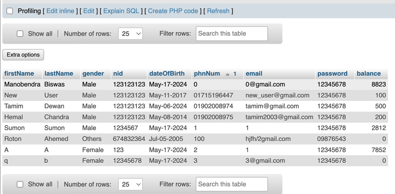
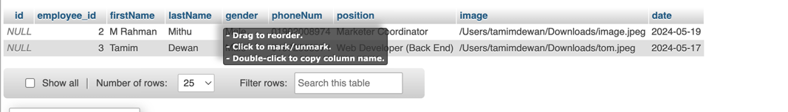

# RAPID Pay 
1. Your Machine should have the latest version of JavaFX and JDK-21 intalled.
   https://openjfx.io/openjfx-docs/
2. Your IDE should also be able to run a MAVEN JavaFX project 

3. You should have Scene Builder and Font-Awesome integrated in it
   https://gluonhq.com/products/scene-builder/

4. Your machine should have MySQL and run apache XAMPP and open localHost
   https://www.apachefriends.org/download.html

5. Your LoaclHoast should look like this :

Admin

Customer 

Employee 

Image 

Transaction Page 

